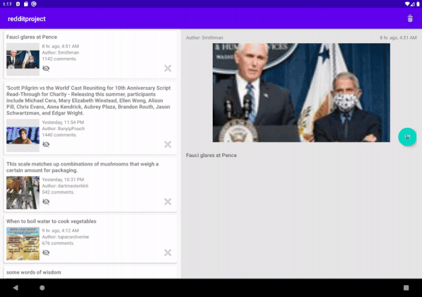

# redditproject

## Features included
- Pull to Refresh
- Pagination support
- Saving pictures in the picture gallery
- App state-preservation/restoration
- Indicator of unread/read post (updated status, after post it’s selected)
- Dismiss Post Button (remove the cell from list. Animations required)
- Dismiss All Button (remove all posts. Animations required)
- Support split layout (left side: all posts / right side: detail post)

### Preview phone portrait

### Preview tablet 

### Technologies used 
Kotlin, MVVM, Clean Architecture, Room, Koin, Coroutines
